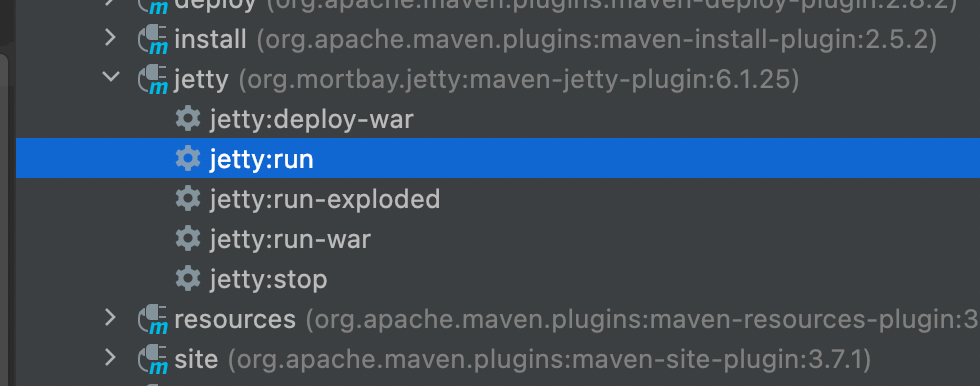

运行步骤：
1.双击

2.在浏览器输入
http://localhost:8001/bbs/index.html

使用数据库：
use sampledb;

1。t_user为用户信息表
    CREATE TABLE t_user (
        `user_id` INT AUTO_INCREMENT PRIMARY KEY,
                user_name VARCHAR(30),
        `credits` INT,
        `password` VARCHAR(32),
        `last_visit` datetime,
        `last_ip` VARCHAR(23)
) ENGINE=InnoDB;
2.t_login_log为用户登录日志表
    CREATE TABLE t_login_log (
        `login_log_id` INT AUTO_INCREMENT PRIMARY KEY,
                user_name VARCHAR(30),
        `user_id` INT,
        `ip` VARCHAR(32),
        `login_datetime` datetime
) ENGINE=InnoDB;

//ENGINE=InnoDB;指定表的引擎为InnoDB类型，该类型的表支持事务
mySql默认采用MyISAM引擎，该类型的表不支持事务，仅存储数据，优点在于读写速度快

3.
insert into t_user(user_name,password) values('admin','123456');

4.
